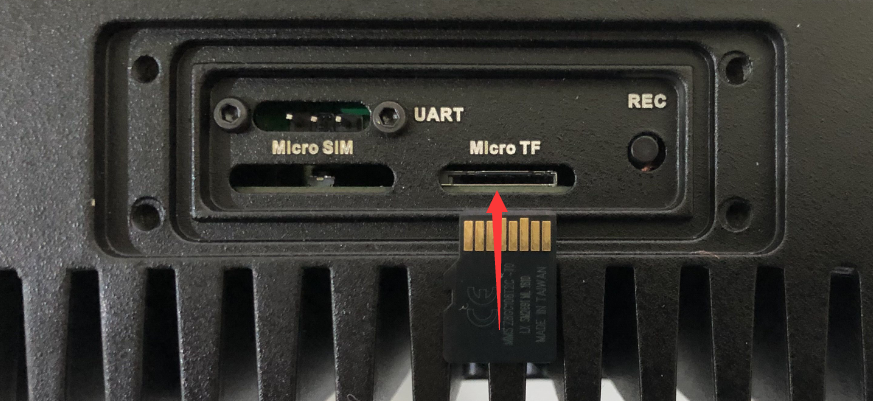
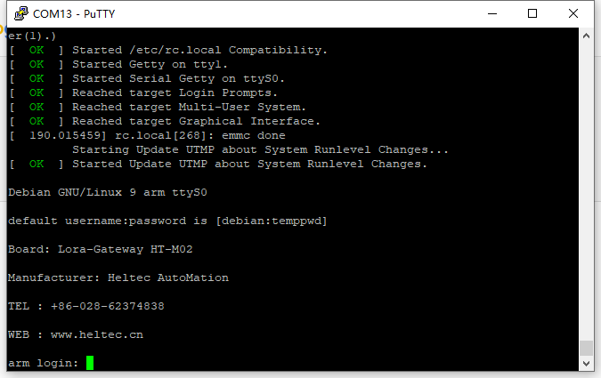

# HT-M02 System Upgrade
:ht_translation:`[简体中文]:[English]`
## Summary

[HT-M02](https://heltec.org/project/ht-m02/) have two method to upgrade the system.

- [Via Micro TF Card](#via-micro-tf-card);
- Online upgrade.

## Via Micro TF card

``` Warning:: The power source for HT-M02 cannot be cut off during the upgrade process, or it may cause permanent damage to the HT-M02 gateway.

```

### Making a System Recovery / Upgrade Card

The process of making a system recovery / upgrade card is exactly the same as the [process of making a Raspberry Pi system card](https://projects.raspberrypi.org/en/projects/raspberry-pi-setting-up/2). If you have experience using Raspberry Pi, this part of the operation will be very simple.

#### Preparation

- Download the latest firmware from [http://resource.heltec.cn/download/HT-M02/firmware](http://resource.heltec.cn/download/HT-M02/firmware)
  - [Latest firmware for HT-M02 4G](https://resource.heltec.cn/download/HT-M02/firmware/heltec-M02-4G-debian-v2.img)
- [Win32DiskImager](http://resource.heltec.cn/download/tools/Win32DiskImager.zip) -- Tool for flashing firmware to a Micro TF card;
- [SD Formatter](http://resource.heltec.cn/download/tools/SD_Formatter.zip) -- It’s not necessary，If you need to format the TF card with an existing image, You need this tool；
- A micro TF card with more than 4GB size, and card reader.

#### Flash the Firmware to Micro TF card

Select Micro TF card by click 1, select  firmware files from disk by click 2, and click `Write`.


Flash complete, the Micro TF card in your computer should like this:


Now the system recovery / upgrade card made complete.

### Upgrade System

#### Preparation

- Power OFF HT-M02 gateway and insert the Micro TF card into the TF card slot;



- [Establish serial connection](https://heltec-automation-docs.readthedocs.io/en/latest/gateway/ht-m02/quick_start_poe.html#serial) if need, system upgrade logs will be printed via the UART.

#### Upgrade

Make sure the Micro TF card already insert into the slot, press the `REC` key, and then power ON HT-M02. Generally speaking, the upgrade process should be: `Insert TF card --> Keep press REC key --> Power ON`.

During the upgrade process, RX LED blink all the time, logs will output via UART.


When RX stop blink, system upgrade complete. **Power OFF HT-M02 and remove Micro TF card**. When the HT-M02 power ON next time, the new system will running from eMMC.

- Default login username: `debian`
- Default login password: `temppwd`



``` Tip:: Don&#39;t forget remove the Micro TF card, or the system will running from TF card automatically in the next powe ON, and the system will be upgrade again.

```

