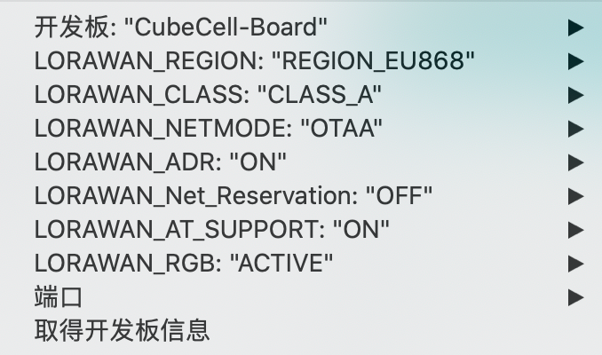
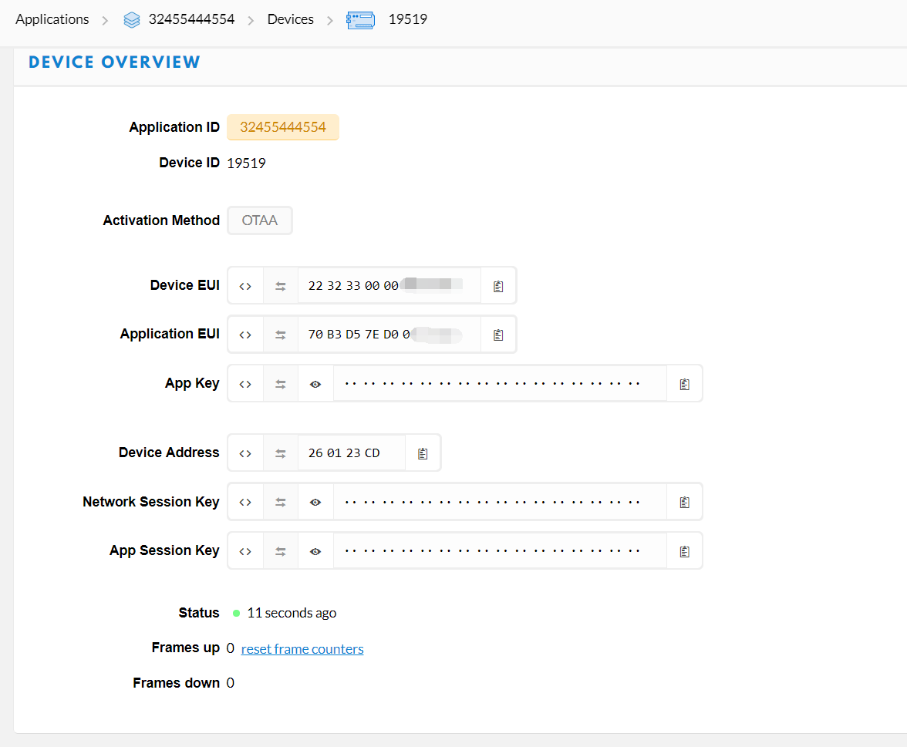
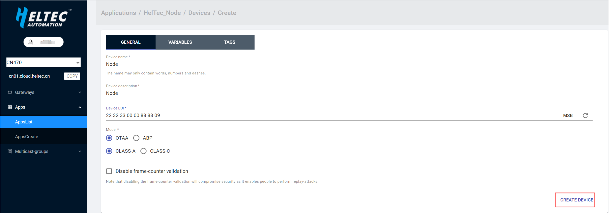
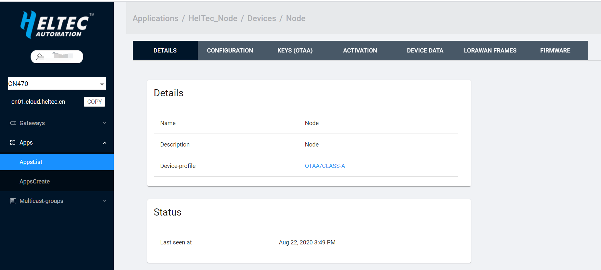

# Connect CubeCell to LoRaWAN Server
{ht_translation}`[简体中文]:[English]`

In this document, all operations and tests must be performed with a standard [LoRaWAN Gateway](https://heltec.org/proudct_center/lora/lora-gateway/), In the CubeCell's LoRaWAN library, for each working band, we are strictly follow [LoRaWAN™ 1.0.2 Regional Parameters rB](https://resource.heltec.cn/download/LoRaWANRegionalParametersv1.0.2_final_1944_1.pdf).

## Summary

LoRaWAN protocol is the essence of all LoRa applications. In our opinion, the most prominent benefits of LoRaWAN are as follows:

- Very friendly for low power applications. For example, your application need send data to server every 10 minutes, then in a cycle, only ~1 second is in the state of sending, other 9 minutes and 59 seconds are in low sleep low power Consuming status.
- A star network can be formed via a [LoRa Gateway](https://heltec.org/proudct_center/lora/lora-gateway/), nodes and gateways from different manufacturers can communicate with each other through LoRaWAN protocols;
- The protocol already includes processing mechanisms such as blocking, automatic frequency modulation, and encryption, which can better ensure the smooth flow of nodes and gateway；
- ADR (Adaptive Data Rate).

``` {Tip} CubeCell LoRaWAN library is migration from LoRaMac-node version v4.3.2

```


## Preparation
- Correct installed Arduino IDE and [CubeCell Framework](https://heltec-automation-docs.readthedocs.io/en/latest/cubecell/quick_start.html).
- A standard LoRaWAN gateway with at least 8 channels (based on SX1301/8 base band chip will be OK), and make sure your gateway had already connected to a LoRa server.
  - [How to connect HT-M01 to a LoRa server](https://heltec-automation-docs.readthedocs.io/en/latest/gateway/ht-m01/connect_to_server.html)
  - [How to connect HT-M02 to a LoRa server](https://heltec-automation-docs.readthedocs.io/en/latest/gateway/ht-m02_4g/quick_start_4g.html#connect-to-lora-server)
- A [CubeCell Dev-Board](https://heltec.org/project/htcc-ab01/) or [CubeCell-Cupsule](https://heltec.org/project/htcc-ac01/) and a high quality USB cable.

**In this example, we use [HT-M01 Mini Gateway](https://heltec.org/project/ht-m01/) in Windows<sup>®</sup> 10. Test band: EU868, others working band is similar.**

### Running an example in Arduino

In the "LoRa" path, all examples named with "LoRaWAN_xxx" format are the examples with LoRaWAN protocol, choose one of them.


Don't forget [config the parameters in "Tools" menu](https://heltec-automation-docs.readthedocs.io/en/latest/cubecell/quick_start.html#correctly-config-the-tools-menu), here is my configration for EU868:



``` Note:: the tools menu must matching with the configration in LoRa server. For example, if CubeCell use OTAA, the LoRa server must enable OTAA for relevant device.

```

## Connect to TTN

Before that, make sure there is a LoRa Gateway active in your TTN's account.

### Register a device

Register a new device in TTN's "Applications" page. The `Device ID`, `Device EUI`, `App Key` can be generated automatically. users need make sure the relevant parameter in CubeCell is the same with TTN.


Correctly config LoRaWAN parameters for CubeCell, please refer to [this document](https://heltec-automation-docs.readthedocs.io/en/latest/cubecell/lorawan/config_parameter.html). If all goes well, we will be able to see Device is alive in "DEVICE OVERVIEW".



## Connect to ChirpStack

Coming soon.

&nbsp;

## Connect to HelTec server

Before that, make sure there is a LoRa Gateway active in your HelTec's account.

### Register a device

Select "AppsCreate" in "Apps" to create a new application, fill in the corresponding information and click "CREATE APPLICATION" to complete the application creation.


Select the newly created application in "AppsList", and create a new device in the application.


Config the "Device EUI" and "App Key" related parameters of the node device. The user needs to ensure that the parameters in the CubeCell are consistent with those configured in the server.




Correctly config LoRaWAN parameters for CubeCell, please refer to [this document](https://heltec-automation-docs.readthedocs.io/en/latest/cubecell/lorawan/config_parameter.html). If all goes well, we will be able to see the status of the device.



&nbsp;

## Important Hints

Please double check the following two things:

1. The LoRaWAN parameters is the same as server!
2. The listening frequency of your LoRa Gateway is the same as CubeCell's sending frequency. We strictly follow [LoRaWAN™ 1.0.2 Regional Parameters rB](https://resource.heltec.cn/download/LoRaWANRegionalParametersv1.0.2_final_1944_1.pdf);